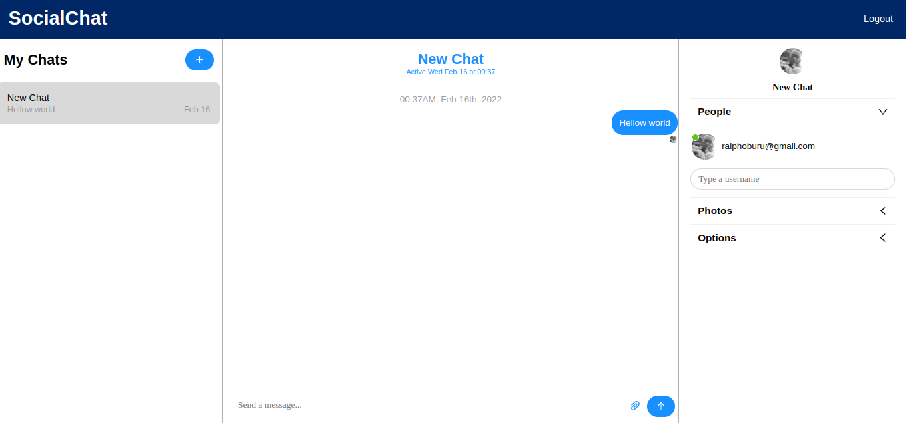

<h1 align="center">The SocialChat</h1>

Link to the live version [live-version][live-version]

The project goal was to build a fully responsive [firebase][firebase] chat application with social auth Google and Facebook, online statuses, image support, sound notifications with the ability to create several chat rooms and more!

### How to open

You can open the chatApp online by clicking [live-version] or locally following these steps:

* Click on the green button "Clone or Download"
* Click on Download ZIP or clone the repository to your desired directory
* Extract the project (This step is for those who download the ZIP)
* In your terminal, navigate to the folder
* Run `npm install` or `yarn install`
* Run `npm start` or `yarn start`

A tab will be opened in the browser.

### Technologies used

To create this project I used:

* JavaScript
* React
* [ChatEngine][chat-engine]
* [firebase][firebase]

## Author

👤 **Ralph Oburu**

- Github: [Ralph-1](https://github.com/ralph-1)
- Twitter: [@NotRalph0](https://twitter.com/NotRalph0)
- LinkedIn: [Ralph](https://linkedin.com/in/ralph-oburu)

[live-version]: https://socialchat1.netlify.app/
[chat-engine]: https://chatengine.io
[firebase]: https://firebase.google.com/
